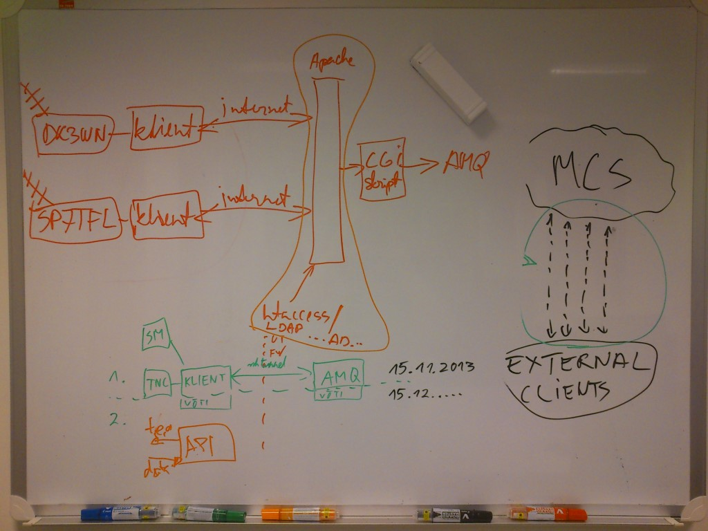

## Simple Downlink Share Convention (SIDS)

### Some history

In the beginning there was:

> Nothing, and somebody needed to bring ideas and people together. Below an image created during one of the brainteam sessions from the ESTCube team.

### Preliminary sources

The idea is, to share history, current state and possible new options in regard to SiDS on this repository, in the meantime the following can be used as some base for getting an idea what SiDS is, and how it can support the question of: "How to store telemetry received by multiple stations, all over the world".

[Simple Downlink Share Convention v0.9 - SiDS](docs/Dombrovski-SIDS-Simple-Downlink-Share-Convention.pdf)\
Author Slavi Dombrovski / University of Würzburg (Germany)\
Created 15 January 2015

### Online sources

Windows based [Software to decode telemetry that is transmitted by satellites](https://www.pe0sat.vgnet.nl/decoding/tlm-decoding-software/dk3wn/) created by DK3WN.\
Telemetry submission when using [gr-satellites ](https://gr-satellites.readthedocs.io/en/latest/command_line.html?highlight=sids#telemetry-submission)\
